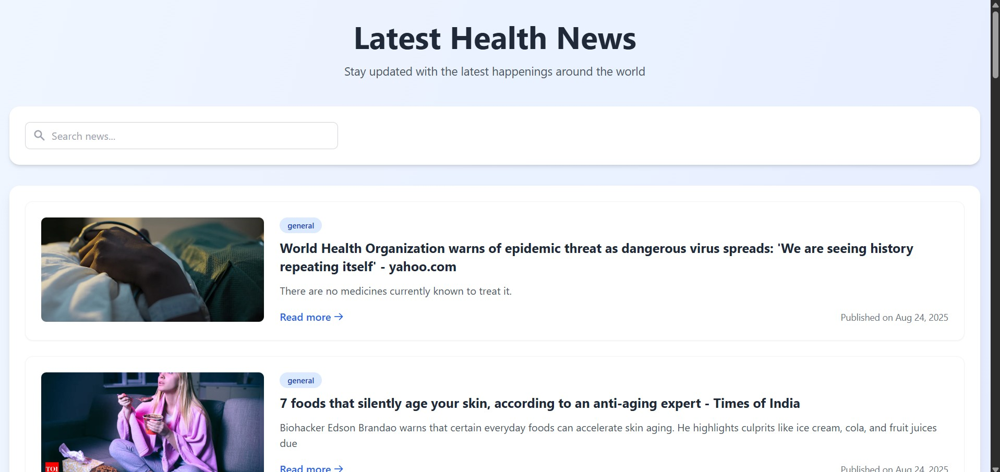

# 📰 Health News App  

<p align="center">
  
</p>

## 📌 About the Project
The **Health News App** is a web application built with **React.js** and **Node.js**, integrated with the **News API**.  
It provides users with the **latest health-related articles** from trusted sources.  

Users can:  
- Browse and read the latest headlines 📰  
- Click **Read More** to view the complete article 🔗  
- Search for specific health topics quickly 🔍  

This app is designed with a clean and responsive interface, ensuring a smooth experience across devices.  

---

## ✨ Features
- 📰 **Latest health news** from trusted sources  
- 🔗 **Read More** option to view full articles  
- 🔍 **Search bar** for specific news topics  
- 📱 **Responsive design** (works on mobile, tablet, desktop)  
- ⚡ **Fast and user-friendly** experience  

---

## 🛠️ Tech Stack
- **Frontend:** React.js, TailwindCSS (Responsive UI)   
- **API Integration:** [News API](https://newsapi.org/)  
- **State Management:** React Hooks  

---

## 🚀 Getting Started

### Prerequisites
Make sure you have installed:
- [Node.js](https://nodejs.org/) (v14+ recommended)  
- npm or yarn  

### Installation
```bash
# Clone the repository
git clone https://github.com/JoySarkar07/Health_News_App.git

# Navigate to the project folder
cd Health_News_App

# Install dependencies
npm install
```
# Start development server
```bash
npm run dev
```
